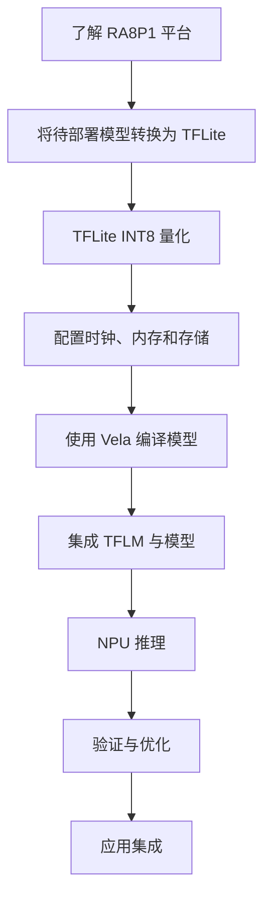

# 完整开发流程

## 开发主线

## 章节内容说明

- **第 2 章：快速入门**
  使用已量化的 MNIST 模型演示完整的部署流程，帮助用户快速运行第一个 AI 示例，无需提前掌握模型转换和量化参数。

- **第 3 章：模型转换与量化**
  介绍 TFLite 模型的 INT8 量化，以及将 ONNX 模型通过 `onnx2tf` 转换为 SavedModel 或 FP32 TFLite 后再进行量化的方法。

- **第 4 章：RA8P1 平台配置**
  使用经过 PC 侧验证的 INT8 TFLite 模型，介绍 RA8P1 的时钟配置、内存规划和模型存储方案。

- **第 5 章：NPU 推理与部署**
  介绍模型编译、工程集成以及使用 Ethos-U55 NPU 执行推理的流程。

- **第 6 章：自定义算子**
  介绍 TFLM 自定义算子的实现、注册与调试方法。

- **第 7 章：性能优化**
  介绍推理性能分析及模型、内存和数据处理等方面的优化方法。

下一步：[开发环境准备](../02-getting-started/prerequisites.md)。
