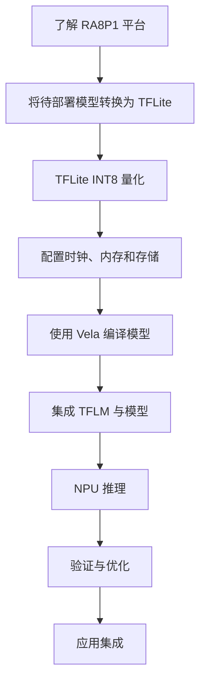

# 完整开发流程

## 开发主线

第 2 章使用已经量化的 MNIST 模型快速展示一次完整部署，不要求先掌握每个转换参数。完成快速入门后，第 3 章再回到模型侧的量化操作：TFLite INT8量化，或者ONNX 模型先通过 onnx2tf 转换为 SavedModel/FP32 TFLite，再执行量化。第 4 章接收经过 PC 侧验证的INT8 TFLite模型，完成 RA8P1 的时钟、内存和存储规划。第 5 章 介绍NPU推理部分内容，第 6 章 性能优化，第 7 章 介绍自定义算子的实现和方法

## 阶段产物

| 阶段 | 主要产物 | 完成标准 |
| --- | --- | --- |
| 快速入门 | MNIST 板端运行记录 | 理解从 TFLite 到板端推理的完整路径 |
| 模型转换与量化 | ONNX模型转换时的SavedModel/FP32 TFLite、已验证的INT8 TFLite | 转换基线、量化精度和接口符合预期 |
| 平台配置 | 时钟、内存和存储设计 | 资源规划可实施 |
| NPU 部署 | Vela 模型、可烧录工程和模型数据 | 设备能稳定推理 |
| 验证优化 | 测试记录 | 精度、延迟和内存满足目标 |
| 自定义算子 |自定义算子CPU侧Kernel实现  | 精度、结果满足目标 |

每个阶段出现问题时，优先回到上一阶段的可验证产物。这样可以避免将模型问题误判为硬件或运行时问题。

下一步：[开发环境准备](../02-getting-started/prerequisites.md)。
