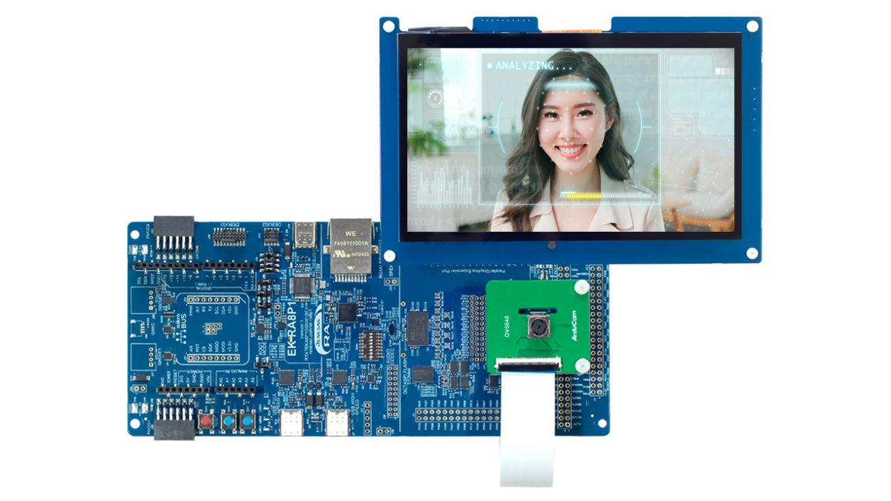

# 开发环境准备

## 硬件

- RA8P1 开发板及其匹配的调试下载器。推荐使用 [EK-RA8P1](https://www.renesas.cn/zh/design-resources/boards-kits/ek-ra8p1#documents)。

EK-RA8P1 提供以下硬件资源：

- J-Link OB 板载调试器
- 7.0 英寸、1024 × 600 并行接口 LCD 板
- 500 万像素 OV5640 摄像头模块
- 以太网接口（RGMII）
- USB 高速主机和设备模式
- 64 MB 外部 Octo-SPI Flash
- 64 MB SDRAM
- PDM MEMS 麦克风
- 带扬声器输出连接的音频编解码器

## 软件

- e2 studio 2026-04及以上。
- FSP 6.5.1 及以上。
- Vela 4.2.0 及以上。
- Segger RTT Viewer 9.42 及以上。
- 用于模型处理的 Python 环境及转换依赖。

下一步：[运行第一个 AI 示例 - MNIST](quick-start.md)。
