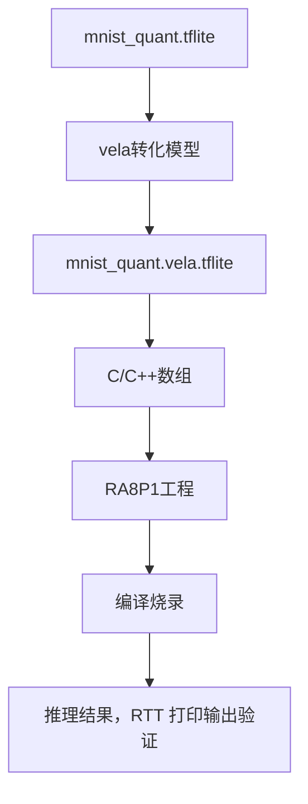

# 运行第一个 AI 示例 - MNIST

## 目标

本节通过使用AI界的Hello World - MNIST 手写数字识别。MNIST 是一个经典的手写数字图像数据集，包含 0～9 共 10 个类别。每张图像为 28 × 28 像素的灰度图，常用于图像分类模型的训练、
验证以及嵌入式 AI 部署流程演示。
通过使用 `mnist_quant.tflite`量化模型 在 EK-RA8P1 上完成 使用Vela进行模型转换、模型部署数组生成、工程编译与烧录和 0 到 9 的推理结果验证。

MNIST RA8P1 工程项目下载地址：

TODO

操作流程如下：




完成本章后，再进入第 3 章学习如何从 TFLite模型直接量化生成INT8 TFLite，或将 ONNX 模型经 onnx2tf 转换后量化。

## 1. 使用 Vela 转换模型


Vela支持的参数很多。每个版本略有不同，可以使用
```bash
vela --help
```
获得每个参数的详细说明。同时，也可以访问ARM Vela官方网页，获取详细信息。目前Vela最新的版本是5.1.0。[Vela 5.1.0 OPTIONS.md](https://gitlab.arm.com/artificial-intelligence/ethos-u/ethos-u-vela/-/blob/5.1.0/OPTIONS.md?ref_type=tags)。

```bash
usage: vela [-h] [--version] [--api-version] [--supported-ops-report] [--list-config-files] [--list-configs LIST_CONFIGS] [--output-dir OUTPUT_DIR] [--output-format {tflite,raw}] [--enable-debug-db]
            [--config CONFIG] [--verbose-all] [--verbose-config] [--verbose-graph] [--verbose-quantization] [--verbose-packing] [--verbose-tensor-purpose] [--verbose-tensor-format] [--verbose-schedule]
            [--verbose-allocation] [--verbose-high-level-command-stream] [--verbose-register-command-stream] [--verbose-operators] [--verbose-weights] [--verbose-cycle-estimate] [--verbose-performance]
            [--verbose-progress] [--show-cpu-operations] [--ignore-ops OP[,OP...]] [--timing] [--force-symmetric-int-weights]
            [--accelerator-config {ethos-u55-32,ethos-u55-64,ethos-u55-128,ethos-u55-256,ethos-u65-256,ethos-u65-512,ethos-u85-128,ethos-u85-256,ethos-u85-512,ethos-u85-1024,ethos-u85-2048}]
            [--system-config SYSTEM_CONFIG] [--memory-mode MEMORY_MODE] [--tensor-allocator {LinearAlloc,Greedy,HillClimb}] [--show-subgraph-io-summary] [--max-block-dependency {0,1,2,3}]
            [--optimise {Size,Performance}] [--arena-cache-size ARENA_CACHE_SIZE] [--cpu-tensor-alignment CPU_TENSOR_ALIGNMENT] [--recursion-limit RECURSION_LIMIT]
            [--hillclimb-max-iterations HILLCLIMB_MAX_ITERATIONS] [--cop-format {COP1,COP2}] [--separate-io-regions] [--experimental-softmax-int16-neg-exp-range EXPERIMENTAL_SOFTMAX_INT16_NEG_EXP_RANGE]
            [--debug-force-legacy-core] [--debug-force-regor] [--disable-chaining] [--disable-fwd] [--disable-cascading] [--disable-buffering] [--disable-ifm-reuse]
            [NETWORK]

Neural network model compiler for Arm Ethos-U NPUs

positional arguments:
  NETWORK               Filename of the input network

options:
  -h, --help            show this help message and exit
  --version             show program's version number and exit
  --api-version         [DEPRECATED] Displays the version of the external API.
  --supported-ops-report
                        Generate the SUPPORTED_OPS.md file in the current working directory and exit
  --list-config-files   Display all available configurations in the `config_files` folder and exit. To select config file, use the --config argument with one of the listed config files (For example: --config
                        Arm/vela.ini )
  --list-configs LIST_CONFIGS
                        Display all configurations defined in the specified config file
  --output-dir OUTPUT_DIR
                        Output directory to write files to (default: output)
  --output-format {tflite,raw}
                        Output format (default: tflite).
  --enable-debug-db     Enables the calculation and writing of a network debug database to output directory
  --config CONFIG       Vela configuration file(s) in Python ConfigParser .ini file format
  --verbose-all         Enable all verbose options
  --verbose-config      Enable system configuration and memory mode debug
  --verbose-graph       Enable graph optimizer debug
  --verbose-quantization
                        Enable quantization debug
  --verbose-packing     [DEPRECATED] Enable pass packing debug
  --verbose-tensor-purpose
                        [DEPRECATED] Enable tensor purpose debug
  --verbose-tensor-format
                        Enable tensor format debug
  --verbose-schedule    Enable schedule debug
  --verbose-allocation  Enable tensor allocation debug
  --verbose-high-level-command-stream
                        Enable high level command stream debug
  --verbose-register-command-stream
                        Enable register command stream debug
  --verbose-operators   [DEPRECATED] Enable operator list debug
  --verbose-weights     Enable weights information debug
  --verbose-cycle-estimate
                        Enable cycle estimate information debug
  --verbose-performance
                        Enable performance information debug
  --verbose-progress    [DEPRECATED] Enable progress information debug
  --show-cpu-operations
                        Show the operations that fall back to the CPU
  --ignore-ops OP[,OP...]
                        Let the specified TFLite builtin operator types fall back to the CPU
  --timing              [DEPRECATED] Time the compiler doing operations
  --force-symmetric-int-weights
                        Forces all zero points to 0 for signed integer weights
  --accelerator-config {ethos-u55-32,ethos-u55-64,ethos-u55-128,ethos-u55-256,ethos-u65-256,ethos-u65-512,ethos-u85-128,ethos-u85-256,ethos-u85-512,ethos-u85-1024,ethos-u85-2048}
                        Accelerator configuration to use (default: ethos-u55-256)
  --system-config SYSTEM_CONFIG
                        System configuration to select from the Vela configuration file (default: internal-default)
  --memory-mode MEMORY_MODE
                        Memory mode to select from the Vela configuration file (default: internal-default)
  --tensor-allocator {LinearAlloc,Greedy,HillClimb}
                        Tensor Allocator algorithm (default: HillClimb)
  --show-subgraph-io-summary
                        [DEPRECATED] Shows a summary of all the subgraphs and their inputs and outputs
  --max-block-dependency {0,1,2,3}
                        [DEPRECATED] Set the maximum value that can be used for the block dependency between npu kernel operations (default: 3)
  --optimise {Size,Performance}
                        Set the optimisation strategy. The Size strategy results in minimal SRAM usage (does not use arena-cache-size). The Performance strategy results in maximal performance (uses the
                        arena-cache-size if specified) (default: Performance)
  --arena-cache-size ARENA_CACHE_SIZE
                        Set the size of the arena cache memory area, in bytes. If specified, this option overrides the memory mode attribute with the same name in a Vela configuration file
  --cpu-tensor-alignment CPU_TENSOR_ALIGNMENT
                        Controls the allocation byte alignment of CPU tensors including Ethos-U Custom operator inputs and outputs (default: 16 Bytes)
  --recursion-limit RECURSION_LIMIT
                        [DEPRECATED] Set the recursion depth limit, may result in RecursionError if too low (default: 1000)
  --hillclimb-max-iterations HILLCLIMB_MAX_ITERATIONS
                        [DEPRECATED] Set the maximum number of iterations the Hill Climb tensor allocator will run (default: 99999)
  --cop-format {COP1,COP2}
  --separate-io-regions
                        Use separate regions for input and output tensors (implies COP2 driver actions format)
  --experimental-softmax-int16-neg-exp-range EXPERIMENTAL_SOFTMAX_INT16_NEG_EXP_RANGE
                        [EXPERIMENTAL]: Set the negative exponent range (0, 65535) for int16 softmax (default: 10.0)
  --debug-force-legacy-core
                        Debug: Use the deprecated legacy Python compilation core
  --debug-force-regor   [DEPRECATED] Debug: Force the use of the regor
  --disable-chaining    [DEPRECATED]
  --disable-fwd         [DEPRECATED]
  --disable-cascading   [DEPRECATED]
  --disable-buffering   [DEPRECATED]
  --disable-ifm-reuse   [DEPRECATED]

```


在 DOS、Powershell（Windows）或 Shell（Linux）环境中运行：

```bash
vela ../model/mnist_quant.tflite \
  --config ra8p1_vela.ini \
  --system-config RA8P1 \
  --memory-mode Sram_Only \
  --optimise Performance \
  --output-dir output_0 \
  > dbg0.log
```
命令中，`ra8p1_vela.ini`是RA8P1的配置文件。它用来配置：

- NPU 时钟
- AXI 端口
- 存储器
- 内存模式

它用来告诉 Vela：RA8P1 的 Ethos-U55 运行多快、Tensor Arena 和模型分别位于哪类内存、这些内存的访问性能如何，以及模型编译时应该采用哪种内存分配和权重缓存策略。

`Sram_Only` 表示转换后的模型的常量、Tensor Arena 和缓存均映射到 AXI0 对应的内存区域

预期输出：

- `dbg0.log`：Vela 转换日志；
- `output_0/mnist_quant.vela.tflite`：部署模型；
- `output_0/mnist_quant_summary_RA8P1.csv`：Vela 汇总数据。

## 3. 生成固件模型数组

使用 xxd 将 Vela 编译后的 TFLite 二进制模型嵌入为 C/C++ 字节数组，供 RA8P1 固件在编译时集成。它不会再次转换或优化模型，只是改变模型的保存形式。

```bash
xxd -i output_0/mnist_quant.vela.tflite array.h
```

## 4. 选择模型与 Arena 存储

小型 MNIST 模型可直接放片内 Flash。若使用 OSPI、SDRAM 或 SRAM，请按[模型存储介质选择](../04-platform-configuration/storage-selection.md)设置 section、对齐和启动复制策略。Tensor Arena 必须放在可写 RAM。

## 5. 工程代码框架介绍

工程代码使用的是Ethos-U Core Software提供的框架。它已经把适配了TFLite for micro RUNTIME。
`inference_process.cpp`中的**InferenceProcess**函数是核心推理代码，它实现了模型导入，模型推理，推理结果输出等操作。

## 6. 编译、烧录并观察 RTT

使用 e2 studio 构建并烧录工程，然后通过 SEGGER RTT Viewer 观察输出。以数字 9 的测试数据为例，预期日志如下：

```text
mnist output:
0 0 0 0 0 0 0 0 0 -1
Status of executed job:
Success
```

输出张量为 INT8，shape 为 `[1, 10]`。`-1` 所在索引是预测类别，`0` 表示非预测类别。上例的索引 9 为识别结果。


## 6. 验证全部样本

工程提供 `input_mnist_0.h` 至 `input_mnist_9.h`。在 `inference.cpp` 中切换包含的输入文件，逐一运行 0 到 9 的样本，完成模型推理结果的验证。


下一步：[模型转换、INT8量化与精度验证](../03-model-preparation/int8-quantization.md)。
