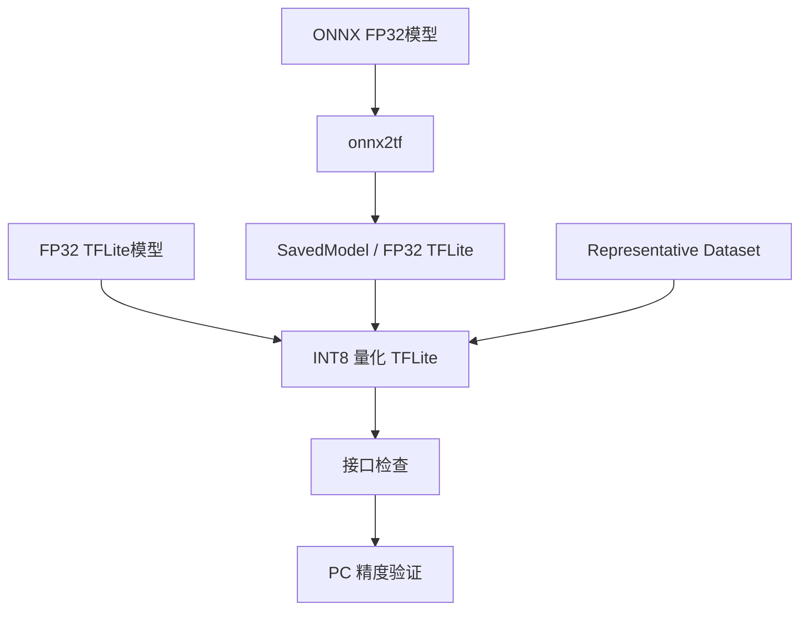

# 模型转换、INT8量化与精度验证

## 本章目标

第 2 章使用现成的 `mnist_quant.tflite` 完成了板端部署。本章回到模型侧，说明如何从 TensorFlow FP32 或 ONNX FP32模型生成INT8 TFLite，并在进入 RA8P1 平台配置前完成 PC 侧精度和接口检查。

两条模型输入路径最终汇合到同一验证流程：




## 1. 转换前固定模型接口

无论采用哪条路径，都应先保存一组固定的基准输入和浮点输出，并记录：

| 项目 | 需要确认的内容 |
| --- | --- |
| 输入 | 名称、shape、布局、数据类型和数值范围 |
| 输出 | 名称、shape 和结果含义 |
| 前处理 | 尺寸调整、通道顺序、归一化和量化规则 |
| 后处理 | 反量化、阈值和标签映射 |
| 工具 | Python、TensorFlow、ONNX 和 onnx2tf 版本 |

优先固定模型输入维度。动态 shape、隐式布局转换或前处理差异会使“文件转换成功”与“推理结果正确”成为两件不同的事。


## 2. 量化为 INT8


### 方案 A：随机校准数据（快速测试用）

> 适用于快速测试，**不推荐用于生产环境**。

```python
import tensorflow as tf
import numpy as np

# 加载 FP32 TFLite 模型，获取输入形状
interpreter = tf.lite.Interpreter(model_path="output_folder/your_model_float32.tflite")
interpreter.allocate_tensors()
input_shape = interpreter.get_input_details()[0]['shape']
print(f"Input shape: {input_shape}")

# 随机校准数据生成器
def representative_dataset():
    for _ in range(100):
        data = np.random.random(input_shape).astype(np.float32)
        yield [data]

# 执行量化转换
converter = tf.lite.TFLiteConverter.from_saved_model("output_folder")
converter.optimizations = [tf.lite.Optimize.DEFAULT]
converter.representative_dataset = representative_dataset
converter.target_spec.supported_ops = [tf.lite.OpsSet.TFLITE_BUILTINS_INT8]
converter.inference_input_type = tf.int8
converter.inference_output_type = tf.int8
quantized_model = converter.convert()

# 保存 INT8 模型
with open("your_model_int8.tflite", "wb") as f:
    f.write(quantized_model)
print(f"✅ 已保存: your_model_int8.tflite ({len(quantized_model)/1024:.2f} KB)")
```

### 方案 B：真实校准数据（推荐用于生产环境）

> 使用应用场景中的真实代表性数据，可获得更好的量化精度。

```python
import tensorflow as tf
import numpy as np

# === 请根据实际情况自定义此部分 ===
# 加载你的校准数据
# 用你自己的数据加载逻辑替换以下函数
def load_calibration_data():
    """
    加载校准数据集。
    返回：形状为 (num_samples, *input_shape) 的 numpy 数组。

    示例：
    - 图像模型: (100, 224, 224, 3)
    - 时间序列: (100, 1, seq_len, features)
    - 音频:    (100, 1, num_frames, num_mels)
    """
    # 示例 1：从 NPZ 文件加载
    # data = np.load("calibration_data.npz")["inputs"]

    # 示例 2：从目录加载图像
    # from PIL import Image
    # images = []
    # for img_path in glob.glob("calibration_images/*.jpg")[:100]:
    #     img = Image.open(img_path).resize((224, 224))
    #     images.append(np.array(img) / 255.0)
    # data = np.array(images)

    # 占位代码 —— 请替换为你自己的数据加载逻辑
    raise NotImplementedError("请用你的数据加载逻辑替换此处")

# 加载校准数据
calibration_data = load_calibration_data()
print(f"已加载 {len(calibration_data)} 个校准样本")
# === 自定义部分结束 ===

# 从模型获取输入形状
interpreter = tf.lite.Interpreter(model_path="output_folder/your_model_float32.tflite")
interpreter.allocate_tensors()
input_details = interpreter.get_input_details()[0]
input_shape = input_details['shape']

# 校准数据生成器
def representative_dataset():
    for i in range(len(calibration_data)):
        sample = calibration_data[i:i+1].astype(np.float32)
        # 确保形状正确（如需要，添加 batch 维度）
        if sample.shape != tuple(input_shape):
            sample = sample.reshape(input_shape)
        yield [sample]

# 执行量化转换
converter = tf.lite.TFLiteConverter.from_saved_model("output_folder")
converter.optimizations = [tf.lite.Optimize.DEFAULT]
converter.representative_dataset = representative_dataset
converter.target_spec.supported_ops = [tf.lite.OpsSet.TFLITE_BUILTINS_INT8]
converter.inference_input_type = tf.int8
converter.inference_output_type = tf.int8
quantized_model = converter.convert()

# 保存 INT8 模型
with open("your_model_int8.tflite", "wb") as f:
    f.write(quantized_model)
print(f"✅ 已保存: your_model_int8.tflite ({len(quantized_model)/1024:.2f} KB)")
```


## ONNX 经 onnx2tf 转换并量化

Vela 不直接接收 ONNX 模型。对于已有 ONNX 模型，先使用 [onnx2tf](https://github.com/PINTO0309/onnx2tf) 生成 TensorFlow SavedModel 和 FP32 TFLite，再从 SavedModel 执行INT8量化。

```text
model.onnx
    -> onnx2tf
    -> SavedModel + FP32 TFLite
    -> TFLite Converter + Representative Dataset
    -> model_int8.tflite
```


### 5.1 使用 onnx2tf 转换

以下命令将 ONNX 模型转换到 `output_folder`，并输出可供 TensorFlow Lite Converter 使用的 SavedModel：

```bash
onnx2tf \
    -i model.onnx \
    -o output_folder \
    --output_signaturedefs
```

转换完成后，不要只确认目录已经生成。应检查转换日志和输出文件，并使用固定参考输入验证 FP32 TFLite。

onnx2tf 可能将 ONNX 的 `NCHW` 输入转换为 TensorFlow/TFLite 常用的 `NHWC` 布局。例如参考模型的输入由 ONNX `[1, 5, 1, 1024]` 变为 TFLite `[1, 1, 1024, 5]`。这不是可以忽略的 shape 变化；设备侧前处理和测试脚本必须按转换后的实际接口准备数据。

### 5.2 从 SavedModel 执行INT8量化

Representative Dataset 必须产生与**转换后 SavedModel 输入接口**一致的 `float32` 样本。以下示例使用 INT8 输入输出接口：

```python
import tensorflow as tf


def representative_dataset():
        for sample in calibration_samples:
                yield [sample.astype("float32")]


converter = tf.lite.TFLiteConverter.from_saved_model("output_folder")
converter.optimizations = [tf.lite.Optimize.DEFAULT]
converter.representative_dataset = representative_dataset
converter.target_spec.supported_ops = [
        tf.lite.OpsSet.TFLITE_BUILTINS_INT8
]
converter.inference_input_type = tf.int8
converter.inference_output_type = tf.int8

quantized_model = converter.convert()
with open("model_int8.tflite", "wb") as file:
        file.write(quantized_model)
```

如果模型有多个输入，Representative Dataset 每次 `yield` 的张量数量、顺序、shape 和 dtype 都必须与 SavedModel signature 一致。随机数据只能用于检查转换流程，不能用于判断最终量化精度。

## 6. 检查输入输出与量化参数

转换完成后，使用 TFLite Interpreter 读取模型接口：

```python
model_path = "your_quant.tflite"  # 或 ONNX 路径生成的 model_int8.tflite
interpreter = tf.lite.Interpreter(model_path=model_path)
interpreter.allocate_tensors()

input_details = interpreter.get_input_details()[0]
output_details = interpreter.get_output_details()[0]

print("input shape:", input_details["shape"])
print("input dtype:", input_details["dtype"])
print("input quantization:", input_details["quantization"])
print("output shape:", output_details["shape"])
print("output dtype:", output_details["dtype"])
print("output quantization:", output_details["quantization"])
```


## 7. PC 侧推理验证

随机少量样本只能用于功能检查，不能作为量化精度结论。发布模型前应使用固定测试集分别评估浮点模型和量化模型，并记录实际测得的精度；本指南不预设未经测试的准确率。

ONNX 路径应至少比较三个阶段：

```text
ONNX 浮点基线 <-> FP32 TFLite <-> INT8量化 TFLite
```

如果 FP32 TFLite 已明显偏离 ONNX 基线，问题位于模型转换或布局处理，不应通过调整量化参数掩盖。只有 FP32 转换基线通过后，才评估量化造成的精度变化。

## 8. 建议测试记录

| 模型 | 大小 | 实测精度 | 输入类型 | 输出类型 |
| --- | ---: | ---: | --- | --- |
| 原始 Keras 或 ONNX | 待填写 | 待填写 | FP32 | FP32 |
| FP32 TFLite | 待填写 | 待填写 | FP32 | FP32 |
| 量化 TFLite | 待填写 | 待填写 | INT8 或 UINT8 | INT8 或 UINT8 |

精度比较必须使用相同的测试数据和等价的前处理、后处理。


下一步：[时钟、Vela 与内存规划](../04-platform-configuration/clock-and-memory.md)。
