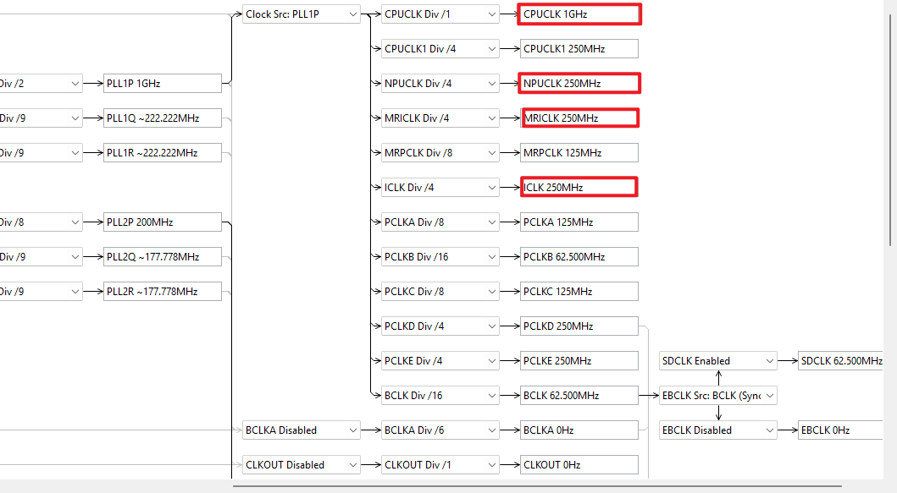

# 时钟、Vela 与内存规划

## 本章目标

本章以模型的接口、大小和精度记录为输入，配置 RA8P1 的 CPU0(Cortex M85)、Ethos-U55 NPU、ICLK 与 MRICLK，并使 Vela 配置、模型位置和运行时内存保持一致。


## 时钟配置

在工程 `configuration.xml` 的 Clock 页面设置 CPU、NPU、ICLK 与 MRICLK。



以下组合是 MNIST 参考工程提供的可选设置：

| 配置标识 | CPU0 | NPU | ICLK / MRICLK |
| --- | ---: | ---: | ---: |
| `MODEL_SETTING_CPU_1000_NPU_500_ICLK_250_MRICLK_250` | 1000 MHz | 500 MHz | 250 / 250 MHz |
| `MODEL_SETTING_CPU_1000_NPU_250_ICLK_250_MRICLK_250` | 1000 MHz | 250 MHz | 250 / 250 MHz |
| `MODEL_SETTING_CPU_500_NPU_500_ICLK_250_MRICLK_250` | 500 MHz | 500 MHz | 250 / 250 MHz |
| `MODEL_SETTING_CPU_500_NPU_250_ICLK_250_MRICLK_250` | 500 MHz | 250 MHz | 250 / 250 MHz |
| `MODEL_SETTING_CPU_250_NPU_250_ICLK_250_MRICLK_250` | 250 MHz | 250 MHz | 250 / 250 MHz |

`inference.cpp` 应选择与工程时钟匹配的模型头文件，例如：

```c
#define MODEL_SETTING MODEL_SETTING_CPU_1000_NPU_250_ICLK_250_MRICLK_250

#if MODEL_SETTING == MODEL_SETTING_CPU_1000_NPU_250_ICLK_250_MRICLK_250
#include "MODEL_SETTING_CPU_1000_NPU_250_ICLK_250_MRICLK_250/output_0/array.h"
#endif
```

## Vela 参数必须同步

Vela 的 `ra8p1_vela.ini` 必须与实际工程时钟一致。`core_clock` 对应 NPUCLK，单位为 Hz：

```ini
[System_Config.RA8P1]
core_clock=250e6
```

按实际时钟计算以下比例，并以浮点格式写入配置：

$$Sram\_clock\_scale = \frac{ICLK}{NPUCLK}$$

$$OffChipFlash\_clock\_scale = \frac{MRICLK}{NPUCLK}$$

两个值范围为 $0.0$ 到 $1.0$。即使结果为整数，也写为浮点数，例如 `1.0`。

## Tensor Arena 与模型的职责

| 对象 | 读写特性 | 推荐介质 |
| --- | --- | --- |
| Model 权重与算子图 | 运行期只读 | Flash 类介质或加载后的 RAM |
| Tensor Arena、输入输出和 NPU 临时区 | 推理期间高频读写 | SRAM；容量不足时使用 SDRAM |

模型权重是只读常量；Tensor Arena 必须位于可写 RAM。不要将两者按同一种内存需求处理。

下一步：[模型存储介质选择](storage-selection.md)。
