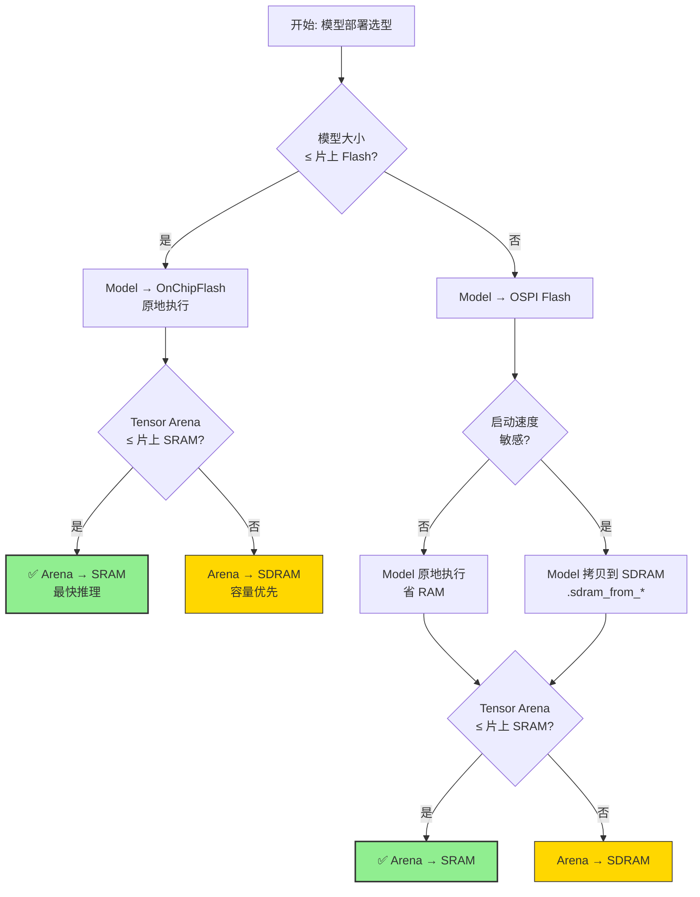

# 模型存储介质选择

时钟与内存规划确定了 NPU、总线和可写内存条件。本页继续讨论说明决定 Vela 输出模型和 Tensor Arena 的实际放置位置。

## 选择原则

模型存放位置同时影响容量、启动时间、读取带宽、布板复杂度和系统内存预算。

## 1. 模型权重放置到不同存储介质

### 1.1 激活张量与权重

在嵌入式 AI 部署（如 RA8P1 + Ethos‑U55 + TFLite Micro）中，有两块最关键的内存对象

| 对象 | 本质 | 典型大小 | 内存属性 | 介质类型 |
|---|---|---|---|---|
| **Tensor Arena**(激活张量) | 推理过程中存放**中间激活张量**、输入/输出张量、Ethos‑U 临时工作区 | 几十 KB ~ 几 MB | **读写**（每次推理都会刷新）| **RAM** |
| **Model**(模型权重) | 神经网络的权重 + 算子图（`.vela.tflite` / `array.h`）| 几十 KB ~ 几十 MB | **只读**（运行期不修改）| **ROM** |


**关键点**：

Model = "代码 + 常量"，烧录后永不改变 → 放 Flash 类介质
Tensor Arena = "栈/堆"，每次推理都会被 NPU/CPU 高频读写 → 必须放在可写且带宽足够高的 RAM 里

### 1.2 存储介质

#### 1.2.1 ROM放 Model（模型权重）
```c
// 这就是 xxd 生成的 array.h
const unsigned char networkModelData[] = {xx,xx,xx,......};
```

| 类型 |C 语言变量修饰符| AI 部署含义 | 适用场景 |
|---|---|---|---|
| **ROM → OnChipFlash** | 无特殊要求，比如这样定义 "const uint8_t buff[] = {xxxx};"|模型放**片上 Flash**（非常快、最省事，但容量有限）| 小模型（< 1MB），MNIST/KWS 这类 |
| **ROM → OSPI (Unit 0, CS 1)** |__attribute__((aligned(16), section(".ospi0_cs1")))| 模型放**外部 OSPI Flash**（容量大，速度次之）| 大模型（YOLO、人脸识别），片上 Flash 装不下 |
| **ROM → SDRAM, init data in OnChipFlash** | __attribute__((aligned(16), section(".sdram_from_flash")))|**运行时把模型从片上 Flash 拷贝到 SDRAM 执行** | 模型在 SDRAM 中跑得比 OSPI 快 |
| **ROM → SDRAM, init data in OSPI** | __attribute__((aligned(16), section(".sdram_from_ospi0_cs1")))|运行时把模型从 OSPI 拷贝到 SDRAM | 大模型 + 追求推理速度 |
| **ROM → SRAM, init data in OnChipFlash**|无特殊要求，比如这样定义 "uint8_t buff[] = {xxxx};" | 模型加载到**片上 SRAM**（最快！但容量最小）| 超小模型，且要求极致推理延迟 |
| **ROM → SRAM, init data in OSPI** |__attribute__((aligned(16), section(".ram_from_ospi0_cs1")))| 模型从 OSPI 拷贝到 SRAM 运行 | 同上，启动介质不同 |

**"initial data in X"** 的含义：
程序启动时，启动代码（startup.c）会把这块数据从 X 拷贝到目标 RAM。
这就是为什么 array.h 写成 const 时直接放 Flash 执行，而去掉 const 时会是直接放置到 RAM 使用。

#### 1.2.2 RAM 放 Tensor Arena（激活张量）

```
// 推理时 NPU/CPU 反复读写的工作内存
uint8_t tensor_arena[ARENA_SIZE] __attribute__((aligned(16), section(".sdram")));
```
| 类型 |C 语言语法|C 语言变量修饰符 AI 部署含义 | 适用场景 |
|---|---|---|---|
| **RAM → SRAM** | 无特殊要求，比如这样定义 "uint8_t buff[];" |Tensor Arena 放**片上 SRAM**（最高带宽，NPU 访问最快）| **首选**！小/中模型，性能最佳 |
| **RAM → SDRAM** | __attribute__((aligned(16), section(".sdram")))|Tensor Arena 放**外部 SDRAM**（容量大但带宽低）| Arena 太大放不进 SRAM 时的退路 |

**性能影响**：
Tensor Arena 放 SRAM 还是 SDRAM，对 NPU 推理时间影响非常大——这正是文档中 Sram_clock_scale 公式的意义所在：所以Vela 在编译时需要知道 SRAM/SDRAM 相对 NPU 的时钟比。




工程中的ospi_b_ep.h中，有如下定义。

| 宏 | 含义 |
| ------ | ------ |
| LOCATE_MODEL_IN_OSPI | 模型权重放置到OSPI Flash中 |
| RUN_MODEL_FROM_SDRAM | 模型权重从OSPI Flash 读出，拷贝到SDRAM中运行 |

通过修改 LOCATE_MODEL_IN_OSPI，RUN_MODEL_FROM_SDRAM的值，来确定模型权重的存储和运行的介质情况。

```c
#define LOCATE_MODEL_IN_OSPI                   1

#define RUN_MODEL_FROM_OSPI                    LOCATE_MODEL_IN_OSPI
#define RUN_MODEL_FROM_DOPI                    0
#define RUN_MODEL_FROM_SDRAM                   LOCATE_MODEL_IN_OSPI

```

#### 1.2.3 TCM（紧耦合内存）使用 / Tightly Coupled Memory


RA8P1 的 Cortex‑M85 内核集成了 **128KB ITCM**（指令 TCM）和 **128KB DTCM**（数据 TCM）。TCM 是直接挂在 CPU 总线上的**零等待**高速 RAM，访问延迟仅 1 个时钟周期，**性能远优于普通 SRAM**，适合放置**性能关键的代码与数据**。


** 使用宏 / Section Placement Macros **

| 宏 | 作用 | 使用示例 |
|---|---|---|
| `BSP_PLACE_IN_SECTION(".itcm")` | 将**代码（函数）** 放置到 ITCM | `void BSP_PLACE_IN_SECTION(".itcm") fast_isr(void) { ... }` |
| `BSP_PLACE_IN_SECTION(".dtcm")` | 将**变量数据**放置到 DTCM | `uint32_t BSP_PLACE_IN_SECTION(".dtcm") fast_buffer[256];` |

下一步：[RA8P1推理流程](../05-npu-deployment/inference-flow.md)。