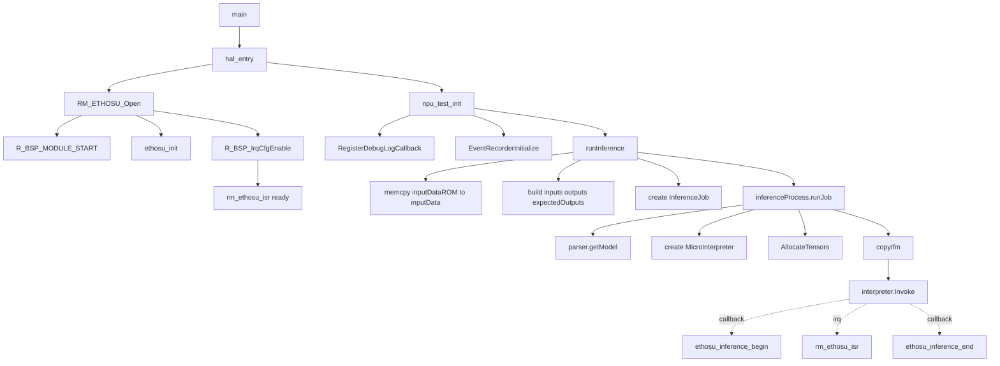

# RA8P1推理流程

本部分描述 RA8P1 上从**上电启动**到**正式进入推理**的完整函数调用流程。

## 1. NPU 上电与推理流程概览


1. **板级启动与 NPU 驱动初始化** —— 完成 NPU 模块上电、驱动对象初始化和中断使能
2. **推理前准备与执行** —— 包括模型解析、张量分配、输入拷贝，最终调用 `Invoke()` 进入推理


---

## 2. 流程图



---

## 3. 分步详解

### 3.1 程序入口

- `main()` 位于 `ra_gen/main.c`
- `main()` 只做一件事：调用 `hal_entry()`

### 3.2 板级启动与 NPU Open

- `hal_entry()` 位于 `src/hal_entry.cpp`
- 在进入主应用前，启动流程先经过 `R_BSP_WarmStart()`，完成 IOPORT 和 SDRAM 等基础初始化
- `hal_entry()` 中调用 `RM_ETHOSU_Open(&g_rm_ethosu0_ctrl, &g_rm_ethosu0_cfg)`，这是 NPU 驱动的打开入口

`RM_ETHOSU_Open()` 位于 `ra/fsp/src/rm_ethosu/rm_ethosu.c`，主要完成以下工作：

| 调用 | 作用 |
|---|---|
| `R_BSP_MODULE_START(FSP_IP_NPU, 0)` | 打开 NPU 模块（取消时钟门控） |
| `ethosu_init(...)` | 使用 `R_NPU_BASE` 初始化 Ethos-U 驱动对象 |
| `R_BSP_IrqCfgEnable(...)` | 使能 NPU 中断 |

**相关实例配置**（位于 `ra_gen/common_data.c`）：

| 实例 | 说明 |
|---|---|
| `g_ethosu0` | 底层 Ethos-U driver 实例 |
| `g_rm_ethosu0_ctrl` | FSP 控制块 |
| `g_rm_ethosu0_cfg` | NPU 配置（IRQ、IPL、安全/特权属性） |

**NPU 中断向量绑定**（位于 `ra_gen/vector_data.c`）：

- `rm_ethosu_isr` —— NPU 完成推理后由此 ISR 处理

### 3.3 推理测试初始化

- `hal_entry()` 在打开 NPU 后调用 `npu_test_init()`
- `npu_test_init()` 位于 `src/inference.cpp`

它主要做三件事：

1. `RegisterDebugLogCallback(print_log)` —— 注册调试日志输出
2. `EventRecorderInitialize(EventRecordAll, 1)` —— 初始化事件记录器
3. 进入 `while(1)` 循环，持续调用 `runInference()`

### 3.4 推理前数据准备

- `runInference()` 位于 `src/inference.cpp`
- 这里开始组织本次推理所需的数据

**主要步骤：**

1. `memcpy(&inputData, &inputDataROM, sizeof(inputData))` —— 将输入数据从只读区复制到 DTCM 运行缓冲区
2. 构造 `inputs`、`outputs`、`expectedOutputs`
3. 使用 `networkModelDataPtr` 和 `networkModelDataSize` 组装 `InferenceJob`


### 3.5 进入推理流程

- `runInference()` 中调用 `inferenceProcess.runJob(job)`
- `runJob()` 实现位于 `src/ethos-u-core-software/applications/inference_process/src/inference_process.cpp`

在真正执行推理前，依次完成：

| 调用 | 作用 |
|---|---|
| `parser.getModel(...)` | 解析并校验 tflite 模型 |
| 创建 `tflite::MicroInterpreter` | 构造 TFLM 解释器 |
| `interpreter.AllocateTensors()` | 在 tensor arena 中分配张量内存 |
| `copyIfm(job, interpreter)` | 将输入数据拷贝到解释器输入张量 |

> 📌 到这里为止，仍处于"进入推理前"的准备阶段。

### 3.6 正式开始推理

- `interpreter.Invoke()` 是正式开始推理的入口
- 当 `Invoke()` 内部调度到 Ethos-U NPU 时，会触发以下机制：

| 阶段 | 调用 | 作用 |
|---|---|---|
| 推理开始 | `ethosu_inference_begin(...)` | 开始 NPU 监控采样 |
| NPU 中断 | `rm_ethosu_isr` | 处理 NPU IRQ（推理完成通知） |
| 推理结束 | `ethosu_inference_end(...)` | 结束监控并释放相关状态 |

---

## 4. 简化调用链

如果只关注主链路，可以简化为：

```
main
  └─> hal_entry
        ├─> RM_ETHOSU_Open                # NPU 模块上电 + 驱动初始化
        └─> npu_test_init
              └─> runInference            # 输入准备 + Job 构造
                    └─> inferenceProcess.runJob
                          ├─> parser.getModel
                          ├─> MicroInterpreter 构造
                          ├─> AllocateTensors
                          ├─> copyIfm     # 拷贝输入到 input tensor
                          └─> Invoke      # 🚀 正式推理
```

下一步：[算子支持](../06-custom-operators/operator-support.md)。
