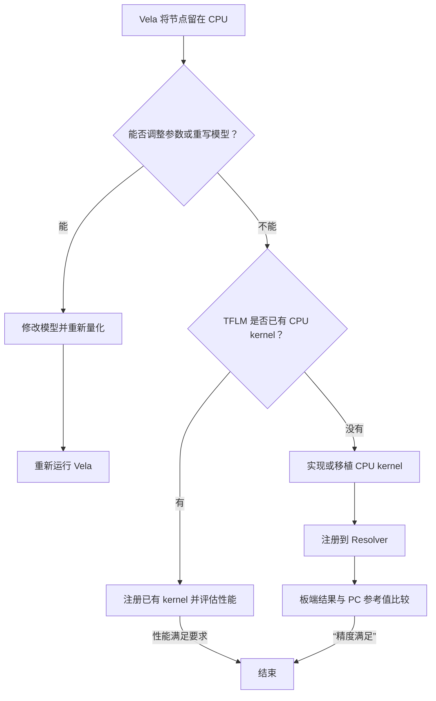
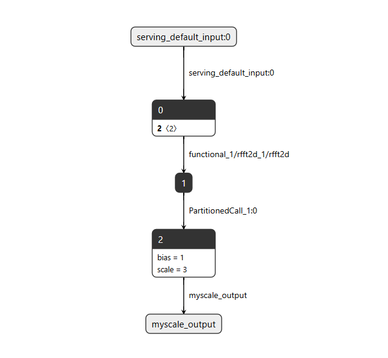
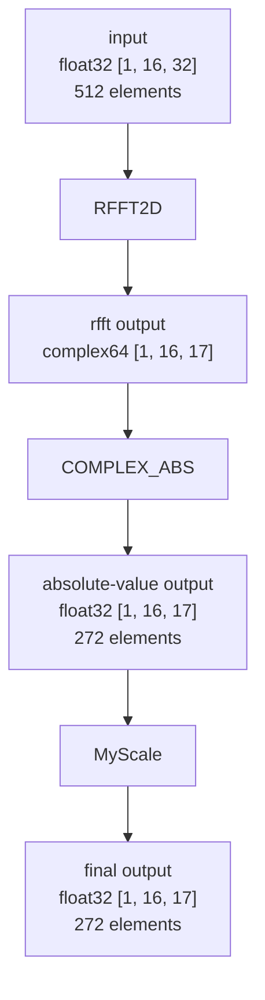
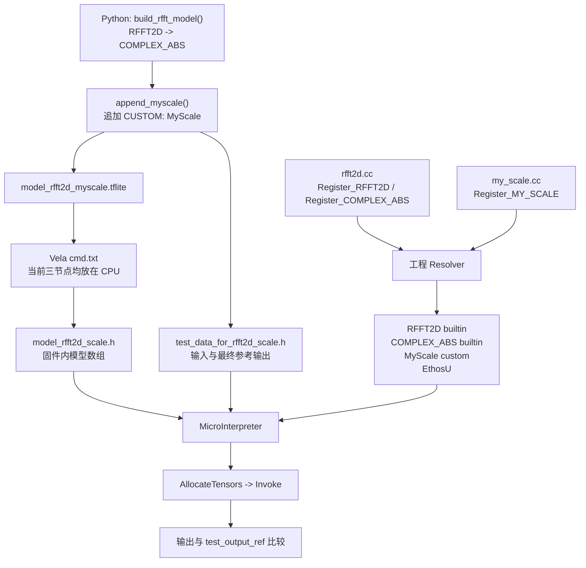

# 自定义算子部署与调试


本章介绍在EK-RA8P1 上的实现自定义算子的过程。
以 `RFFT2D -> COMPLEX_ABS -> MyScale` 参考模型，目标是在当前工程中，把模型生成、算子实现、Resolver 注册、模型执行和结果比对串成一条可调试的链路。

RFFT2D 工程项目下载地址：
TODO

## 进入本章前的判断




## 参考工程与目标


CMSIS-NN 已包含在工程环境中，但当前三个节点没有使用 CMSIS-NN。`RFFT2D` 通过 CMSIS-DSP 在 Cortex-M85 上执行。

### 模型介绍

- 模型结构图：



本文中的“自定义算子”包含两种需要工程侧补充实现的情况：

- `RFFT2D` 与 `COMPLEX_ABS` 是模型中的 builtin 节点；当前工程在 `rfft2d.cc` 中提供它们的 kernel 和注册函数。
- `MyScale` 是模型中的真正 `CUSTOM` 节点；模型用 `customCode="MyScale"` 标识它，工程以同一字符串注册。

文中当前部署使用 CMSIS-DSP 实现 RFFT2D；`rfft2d.cc` 以 `USE_CMSIS_DSP` 选择该路径。

### 开发环境版本记录

请在开始构建、模型转换或复现问题前填写下表。版本会影响工程生成、模型转换和运行时行为；调试记录应与本表保持一致。

| 项目 | 版本/配置 | 填写说明 |
| --- | --- | --- |
| e2 studio | 2026-04.2 |  IDE 版本号。 |
| Renesas FSP | 6.5.1 | FSP 包版本号。 |
| Vela | 4.2.0 | 用于模型转换的 Vela 版本。 |
| Python | 3.10.5 | 运行模型生成脚本的 Python 版本。 |
| TensorFlow | 2.18.0 | 模型构建与转换环境中的 TensorFlow 版本。 |
| TensorFlow Lite | 2.18.0 | Python 环境中 TensorFlow Lite / Interpreter 对应版本。 |
| CMSIS-DSP | 1.16.2 | RFFT2D 使用的 CMSIS-DSP 版本。 |
| CMSIS-NN | 7.0.0 | 当前模型未使用。 |
| Ethos-U Stack | 25.2.0 | 工程使用的 Ethos-U Core Software / Core Driver 软件栈版本。 |
| LLVM | 21.1.1 | 嵌入式代码toolchain版本。 |
| SEGGER J-LINK | 9.42 | 用于下载、调试和 RTT 日志输出的 SEGGER J-Link 软件版本。 |

### 术语

| 术语 | 本文含义 |
| --- | --- |
| builtin 节点 | 模型使用固定 builtin opcode 表示的节点；本模型中为 `RFFT2D`、`COMPLEX_ABS`。 |
| CUSTOM 节点 | 模型使用 `CUSTOM` opcode 和字符串标识的节点；本模型中为 `MyScale`。 |
| Resolver | 将模型节点映射到 `TFLMRegistration` 的注册表。 |
| Prepare | 张量分配阶段执行的输入、输出类型和 shape 检查。 |
| Eval | 每个节点的实际计算回调，在解释器执行阶段被调用。 |

---

## 1. 概述与流程图

### 1.1 为什么需要本工程的算子实现

模型的三个节点并不能只靠模型文件自动执行：每个节点都必须在 Resolver 中找到对应的 registration。当前工程由 `rfft2d.cc` 提供 `Register_RFFT2D()` 和 `Register_COMPLEX_ABS()`，由 `my_scale.cc` 提供 `Register_MY_SCALE()`；随后 `get_resolver()` 创建 `micro_op_resolver`，调用 `AddRfft2D()`、`AddComplexAbs()` 和 `AddCustom("MyScale", Register_MY_SCALE())`，将这三个节点的 registration 加入 Resolver。

其中，`RFFT2D` 和 `COMPLEX_ABS` 必须按照 builtin opcode 注册；`MyScale` 则必须使用模型中精确的 custom code `"MyScale"` 注册。若类型或名称不匹配，问题会在节点查找或 `Prepare` 阶段出现。

### 1.2 本指南最终跑通的目标

本指南的最小闭环是：用同一套模型和测试数据，让 RA8P1 上的 TFLM 依次完成 `RFFT2D`、`COMPLEX_ABS`、`MyScale` 三个节点的 `Prepare` 和 `Eval`，然后把板端结果与脚本生成的参考输出比较。

当前工程的目标张量关系如下：



当前脚本生成的 MyScale 参数为 `scale=3.0`、`bias=1.0`，因此最终参考输出为：

$$final=|RFFT2D(input)|\times3.0+1.0$$

板端调试的成功标志不是只看到程序运行，而是同时满足：

1. Resolver 的四项注册均成功：`COMPLEX_ABS`、`RFFT2D`、`MyScale`、`EthosU`。
2. 三个算子的 `Prepare` 均通过，最终输出 tensor 为 272 个 `float32` 元素，即 1088 字节。
3. `AllocateTensors()`、输入拷贝、解释器执行和输出拷贝均返回成功。
4. 板端输出可与 `test_output_ref` 比较，并打印最大绝对误差。

### 1.3 总体流程图



### 1.4 自定义算子实现步骤

  实现一个自定义算子时，模型侧与 MCU 侧必须使用同一份算子契约：模型定义节点名称、输入输出和参数；MCU 侧实现 `Init`、`Prepare`、`Eval`，再将 registration 加入 Resolver。最后使用同一份输入与参考输出验证完整链路。当前 `MyScale` 就遵循这一流程。

  ```mermaid
  flowchart TD
    A["定义模型节点<br/>输入、输出、customCode、参数"] --> B["生成 .tflite 与参考数据"]
    B --> C["实现 MCU kernel<br/>Init -> Prepare -> Eval"]
    C --> D["实现 Register_XXX()"]
    D --> E["Resolver: AddCustom(名称, Register_XXX())"]
    E --> F["编译并链接算子源文件"]
    F --> G["AllocateTensors -> Invoke"]
    G --> H["与 test_output_ref 比较"]
  ```

  其中 `AddCustom()` 的名称必须与模型 `customCode` 完全一致；`Prepare()` 必须确认 tensor 类型和 shape，`Eval()` 才执行实际计算。若算子使用 CMSIS-DSP 或 CMSIS-NN，库调用位于 `Eval()` 内部，不会改变该注册与验证步骤。

### 1.5 当前参考工程事实摘要

| 模块 | 当前工程中的事实 |
| --- | --- |
| 模型 | `model_rfft2d_myscale.tflite` 由 `generate_model_rftt2d_myscale.py` 生成，节点顺序为 `RFFT2D -> COMPLEX_ABS -> MyScale`。 |
| 输入与输出 | 输入为 `float32 [1,16,32]`；最终输出为 `float32 [1,16,17]`。测试数据文件定义输入 512 个 float、输出 272 个 float。 |
| RFFT2D | `rfft2d.cc` 要求两个输入、一个输出；其输出类型为 `complex64`，最后一维为 `W/2+1`。 |
| COMPLEX_ABS | 实现位于 `rfft2d.cc`，读取交错的 `real, imag` float，并计算 $\sqrt{real^2+imag^2}$。 |
| MyScale | `my_scale.cc` 的计算为 $out=in\times scale+bias$；`Init()` 从 FlexBuffer 读取 `scale` 和 `bias`。 |
| Resolver | `kNumberOperators = 4`；当前注册 `AddComplexAbs()`、`AddRfft2D()`、`AddCustom("MyScale", ...)` 和 `AddEthosU()`，并打印每项注册状态。 |
| 调试代码 | `inference.cpp` 可打印模型节点、输入/输出 sample 与最大绝对误差；运行流程会报告 `AllocateTensors()`、拷贝及 `Invoke()` 状态。 |
| Vela 结果 | `cmd.txt` 和模型头文件的注释均表明：`RFFT2D`、`COMPLEX_ABS`、`MyScale` 当前放在 CPU，汇总为 3 个 CPU operators、0 个 NPU operators。 |
| CMSIS-DSP RFFT2D | 当前部署通过 `USE_CMSIS_DSP` 选择 `CmsisRfft2d()`；该实现逐行调用 CMSIS-DSP RFFT、逐列调用 CFFT，替代仅用于小尺寸调试的朴素 DFT。 |

---

## 2. 模型概览与数据流

### 2.1 模型结构与节点职责

本工程模型由 `generate_model_rftt2d_myscale.py` 生成，最终模型文件为 `model_rfft2d_myscale.tflite`。脚本先创建 `RFFT2D -> COMPLEX_ABS` 的 base 模型，再追加 `MyScale` 作为最终输出节点。

模型数据流是：

```text
float32 [1, 16, 32]
        |
        v
RFFT2D (builtin)
        |
        v
complex64 [1, 16, 17]
        |
        v
COMPLEX_ABS (builtin)
        |
        v
float32 [1, 16, 17]
        |
        v
MyScale (CUSTOM)
        |
        v
float32 [1, 16, 17]
```

`RFFT2D` 与 `COMPLEX_ABS` 是 builtin 节点；`MyScale` 是 `CUSTOM` 节点，模型写入的 `customCode` 为精确字符串 `"MyScale"`。当前 MyScale 参数为 $scale=3.0$、$bias=1.0$，并通过 FlexBuffer `customOptions` 保存。

### 2.2 模型生成与 MyScale 节点追加

`build_rfft_model()` 先建立 base 模型：

```python
inp = tf.keras.Input(shape=(height, width), name="input", dtype=tf.float32)
x = tf.keras.layers.Lambda(lambda y: tf.signal.rfft2d(y), name="rfft2d")(inp)
x = tf.keras.layers.Lambda(lambda y: tf.abs(y), name="complex_abs")(x)
return tf.keras.Model(inp, x)
```

随后 `append_myscale()` 取得 base 模型的原输出张量 `old_out`，新增同 shape 的 `float32` 张量作为 MyScale 输出，并将子图输出更新为新张量。

```python
old_out = sg.outputs[0]
out_shape = list(sg.tensors[old_out].shape)

t = schema_fb.TensorT()
t.shape = out_shape
t.type = schema_fb.TensorType.FLOAT32
t.buffer = 0
t.name = "myscale_output"
sg.tensors.append(t)
new_out = len(sg.tensors) - 1

op.inputs = [int(old_out)]
op.outputs = [int(new_out)]
sg.operators.append(op)
sg.outputs = [int(new_out)]
```

MyScale 是逐元素运算，不改变 shape；更新 `sg.outputs` 能保证部署模型输出来自 MyScale，而不是中间的幅值张量。可通过脚本的 `inspect_combined_model()` 验证节点顺序和 `custom_code='MyScale'`。

### 2.3 输入、输出与张量映射

脚本定义 `CMSIS_RFFT2D_HEIGHT = 16`、`CMSIS_RFFT2D_WIDTH = 32`。输入共有 $1\times16\times32=512$ 个元素；RFFT2D 的输出宽度为 $W/2+1=17$，后续两个节点均保持 `[1,16,17]`，共有 $1\times16\times17=272$ 个实数元素。

| 阶段 | 张量类型 | shape | 元素布局/计算 |
| --- | --- | --- | --- |
| 输入 | `float32` | `[1,16,32]` | 512 个实数。 |
| RFFT2D 输出 | `complex64` | `[1,16,17]` | 每个复数由相邻两个 `float` 保存：`real, imag`。 |
| COMPLEX_ABS 输出 | `float32` | `[1,16,17]` | 每个元素为 $\sqrt{real^2+imag^2}$。 |
| MyScale 输出 | `float32` | `[1,16,17]` | 每个元素为 $input\times scale+bias$。 |

Vela 输出表明这三个节点当前均放在 CPU：`CPU operators = 3 (100.0%)`、`NPU operators = 0 (0.0%)`。因此，初次调试应先验证 CPU kernel、Resolver 和参考输出，不应假设三个节点由 Ethos-U55 执行。

**名称不要混淆：** Vela 警告中的 `CUSTOM 'myscale_output'` 对应脚本为新输出 tensor 设置的 `t.name = "myscale_output"`；它不是 CUSTOM 节点的 `customCode`。Resolver 的匹配键仍是 `oc.customCode = "MyScale"`，因此必须使用 `AddCustom("MyScale", Register_MY_SCALE())`，不能用 `"myscale_output"`。

---

## 3. 核心实现代码参考列表


| 文件 | 说明 |
|--- | --- |
| `src/my_scale.cc` | `MyScaleParams`；`kInputTensor`、`kOutputTensor`；`Init()`、`Prepare()`、`Eval()`、`SetOutputDimsFromInput()`、`Register_MY_SCALE()`；FlexBuffer 键 `scale`、`bias`；`MyScale Prepare...` 日志。 |
| `src/rfft2d.cc` | `kInputTensor`、`kFftLengthTensor`、`kOutputTensor`；`Prepare()`、`Eval()`、`NaiveRfft2d()`、可选的 `CmsisRfft2d()`、`SetTensorDims()`、`IsPowerOfTwo()`、`Register_RFFT2D()`、`Register_COMPLEX_ABS()`；`USE_CMSIS_DSP` 条件编译；三个 `Prepare` 日志。 |
| `src/complex_abs.h` | `Register_COMPLEX_ABS()` 的声明。当前允许范围内未发现独立的 `complex_abs.c` 或 `complex_abs.cc`；其注册和执行实现位于 `rfft2d.cc`。|
| `src/py/generate_model_rftt2d_myscale.py` | 模型构建、`append_myscale()`、`inspect_model()`、`inspect_combined_model()`、`run_inference()`、`generate_all()`；`CMSIS_RFFT2D_HEIGHT=16`、`CMSIS_RFFT2D_WIDTH=32`、`MYSCALE_SCALE=3.0`、`MYSCALE_BIAS=1.0`；模型节点及张量连接。文件名实际为 `rftt2d`，与任务中所写名称不同。 |
| `src/py/model_rfft2d_myscale.tflite` | 最终部署模型二进制；由 `COMBINED_TFLITE_PATH` 指向。其节点结构由 schema 检查函数输出。 |
| `src/py/vela_convert/cmd.txt` | Vela 转换命令；`RFFT2D`、`COMPLEX_ABS`、`CUSTOM 'myscale_output'` 的 CPU 放置警告；`CPU operators = 3`、`NPU operators = 0`。 |


### 3.1 模型节点索引

| 节点 | 模型类别 | 输入 | 输出 | 参数或注册标识 |
| --- | --- | --- | --- | --- |
| `RFFT2D` | builtin | `float32 [1,16,32]` 与 `int32` FFT 长度张量 | `complex64 [1,16,17]` | `BuiltinOperator_RFFT2D`，`Register_RFFT2D()` |
| `COMPLEX_ABS` | builtin | `complex64 [1,16,17]` | `float32 [1,16,17]` | `BuiltinOperator_COMPLEX_ABS`，`Register_COMPLEX_ABS()` |
| `MyScale` | `CUSTOM` | `float32 [1,16,17]` | `float32 [1,16,17]` | `customCode="MyScale"`，FlexBuffer `scale`/`bias`，`Register_MY_SCALE()` |

---

## 4. 基本概念：builtin、未移植 builtin 与 custom

### 4.1 三种情况

1. **模型 builtin 节点**：模型以固定 builtin opcode 表示的节点。本模型的 `RFFT2D` 和 `COMPLEX_ABS` 属于这一类。
2. **工程中需要补充 kernel 的 builtin**：即使模型节点是 builtin，工程仍必须提供与其 opcode 对应的 registration 和执行代码。`rfft2d.cc` 为两个节点提供了 registration、`Prepare` 和 `Eval`。
3. **真正的 custom 节点**：模型 opcode 为 `CUSTOM`，并包含字符串 `customCode`。`append_myscale()` 追加的 `MyScale` 正是该情况。

**关键区别：**

```cpp
// builtin 节点按 builtin opcode 匹配。
AddBuiltin(BuiltinOperator_RFFT2D, Register_RFFT2D(), ParseNoBuiltinOptions);

// custom 节点按 customCode 字符串匹配。
AddCustom("MyScale", Register_MY_SCALE());
```

上面的注册形式来自工程内参考。对本模型而言，`AddCustom("RFFT2D", ...)` 不能替代 builtin 注册，因为脚本没有把 `RFFT2D` 改写成 `CUSTOM`；它只为 `MyScale` 新建了 `CUSTOM` opcode。

### 4.2 为什么 builtin 节点仍要自己实现 kernel

`builtin` 只说明模型声明“这里需要执行某个标准算子”，例如 `RFFT2D`；它不保证 MCU 工程已经有这段算子的执行代码。需要区分三个对象：模型负责声明需要什么算子，TFLM 工程负责提供 kernel 并通过 Resolver 找到它，RA8P1 固件负责把这些工程代码编译、链接后运行在芯片上。

因此，如果 builtin 节点无法执行，应检查当前 TFLM 工程是否包含对应 kernel，以及该 kernel 是否已加入 Resolver；不应将问题理解为“RA8P1 硬件不支持 builtin 算子”。要让一个 builtin 节点在当前 TFLM 工程中运行，以下三层必须同时存在：

| 层次 | `RFFT2D` / `COMPLEX_ABS` 在当前工程中的含义 | 缺失时的结果 |
| --- | --- | --- |
| 模型标识 | `.tflite` 将节点标记为 builtin `RFFT2D` 或 `COMPLEX_ABS`。 | 运行时不知道模型需要什么运算。 |
| Resolver 映射 | TFLM Resolver 用 `AddBuiltin(BuiltinOperator_..., Register_..., ...)` 将 builtin opcode 关联到 registration。 | TFLM 解释器无法由模型 opcode 找到实现。 |
| Kernel 实现 | TFLM registration 提供 `Prepare` 和 `Eval`；前者检查并设置 tensor，后者执行 FFT 或复数幅值计算。 | 即使找到 opcode，也没有可执行代码完成计算。 |

因此，本工程需要“自己实现”的是当前 TFLM 构建所需的第三层 kernel，并在第二层把它加入 Resolver；不是因为 RA8P1 要求把 `RFFT2D` 或 `COMPLEX_ABS` 改写为 `CUSTOM` 节点。`rfft2d.cc` 中的两个 registration 就是具体证据：

```cpp
TFLMRegistration* Register_RFFT2D() {
  static TFLMRegistration r =
      tflite::micro::RegisterOp(/*init=*/nullptr, Prepare, Eval);
  return &r;
}

TFLMRegistration* Register_COMPLEX_ABS() {
  static TFLMRegistration r =
      tflite::micro::RegisterOp(/*init=*/nullptr, /*prepare=*/..., /*eval=*/...);
  return &r;
}
```

`Register_RFFT2D()` 使用的 `Prepare` 会检查两个输入、一个输出、类型和 FFT shape；当前部署的 `Eval` 调用 `CmsisRfft2d()`，未启用 `USE_CMSIS_DSP` 时才回退到 `NaiveRfft2d()`。`Register_COMPLEX_ABS()` 的 `Prepare` 检查 `complex64 -> float32`，其 `Eval` 对每个复数计算幅值。这些都是 builtin opcode 自身不携带、必须由当前 TFLM 构建链接的代码提供的执行行为。

可以把三类节点理解为下表：

| 节点 | 模型中的身份 | 工程为什么仍需代码 | 正确注册键 |
| --- | --- | --- | --- |
| `RFFT2D` | builtin | 当前工程需要提供 FFT 的 `Prepare` 和 `Eval`。 | `BuiltinOperator_RFFT2D` |
| `COMPLEX_ABS` | builtin | 当前工程需要提供复数幅值的 `Prepare` 和 `Eval`。 | `BuiltinOperator_COMPLEX_ABS` |
| `MyScale` | `CUSTOM` | 模型没有 builtin opcode 可映射，工程需提供 kernel，并按模型写入的名称查找。 | `"MyScale"` |

**如何验证：** 若 builtin 节点没有正确加入 Resolver，问题会发生在 `AllocateTensors()` 前后的节点查找阶段；若注册成功但 `Prepare` 的类型或 shape 检查失败，日志会显示 `RFFT2D Prepare failed...` 或 `COMPLEX_ABS Prepare failed...`。当两个 builtin kernel 都执行成功后，数据才会流入 `MyScale`。

### 4.3 如何确认模型节点

执行生成脚本中的 `inspect_combined_model()` 会直接使用 schema 遍历 `sg.Operators()`：builtin 节点打印 builtin 名称，`CUSTOM` 节点打印 `custom_code`。

预期的逻辑顺序为：

```text
node[0]  BUILTIN RFFT2D
node[1]  BUILTIN COMPLEX_ABS
node[2]  CUSTOM  custom_code='MyScale'
```

这里最关键的验证点是最后一行的字符串必须为 `MyScale`，且大小写一致。脚本中写入该字符串的位置是：

```python
oc.builtinCode = schema_fb.BuiltinOperator.CUSTOM
oc.deprecatedBuiltinCode = schema_fb.BuiltinOperator.CUSTOM
oc.customCode = "MyScale"
```

这也是 MCU 侧 `AddCustom()` 必须使用 `"MyScale"` 的原因。

---

## 5. 各算子的设计目的与实现

### 5.1 Cortex-M85 上的 CMSIS 优化路径

RA8P1 使用 Cortex-M85 内核。除直接编写 C/C++ 循环外，自定义算子的 `Eval()` 还可以根据运算类型考虑调用 CMSIS 库完成实现或优化。

| 库 | 适合的自定义算子类型 | 当前工程状态 |
| --- | --- | --- |
| CMSIS-DSP | FFT、滤波、向量数学、复数或其他信号处理运算。 | 当前 RFFT2D 通过 `USE_CMSIS_DSP` 使用 `CmsisRfft2d()`：逐行调用 CMSIS-DSP RFFT，逐列调用 CFFT。该实现替代 `NaiveRfft2d()` 的朴素 DFT，当前工程确认其速度快很多。 |
| CMSIS-NN | 量化神经网络类运算，例如卷积、全连接、激活或池化等可映射的计算。 | 工程目录包含 CMSIS-NN；当前 `rfft2d.cc` 和 `my_scale.cc` 没有调用 CMSIS-NN API，因此 `RFFT2D`、`COMPLEX_ABS`、`MyScale` 当前并非 CMSIS-NN 实现。 |

CMSIS-DSP 与 CMSIS-NN 都只改变 kernel 的内部实现；它们不改变模型节点类型、`Register_*()` 接口、Resolver 注册方式或张量契约。无论使用手写循环还是 CMSIS 库，仍必须让 `Prepare()` 验证类型/shape，并让 `Eval()` 按模型约定读写 tensor。

**当前模型的选择：** RFFT2D 属于信号处理计算，当前工程已经使用 CMSIS-DSP 实现；MyScale 是简单的逐元素浮点计算，当前直接使用循环实现。这里的 CMSIS-DSP 仍在 Cortex-M85 CPU 上运行，并不表示 RFFT2D 被 Ethos-U 执行；性能比较对象是 `NaiveRfft2d()` 的朴素 DFT 循环。若未来新增量化神经网络类 custom kernel，可评估 CMSIS-NN，但需要先确认输入/输出数据类型、量化参数、所选 API 的约束和构建链接配置。

### 5.2 RFFT2D：将二维实数输入转换为二维复数频谱

`RFFT2D` 的 `Prepare()` 要求：两个输入、一个输出；第一个输入为 `float32`，第二个 FFT 长度输入为 `int32`，输出为 `complex64`。输入 rank 至少为 2，最后两个维度 `H`、`W` 必须是 2 的幂。

#### 数学定义

对一个二维实数输入 $x[h,w]$，本工程的 `NaiveRfft2d()` 为每一个输出频率坐标 $(u,v)$ 计算二维离散傅里叶变换：

$$
X[u,v] = \sum_{h=0}^{H-1}\sum_{w=0}^{W-1}
x[h,w]\cdot e^{-j2\pi\left(\frac{uh}{H}+\frac{vw}{W}\right)}
$$

其中，$h$、$w$ 是输入空间坐标，$u$、$v$ 是频率坐标，$H$ 和 $W$ 分别是输入最后两维的高度和宽度。因为输入是实数，当前实现仅计算宽度方向的非冗余频率：

$$
0 \leq u < H, \qquad 0 \leq v < \frac{W}{2}+1
$$

将复指数展开后，输出复数 $X[u,v]=R[u,v]+jI[u,v]$ 的实部和虚部分别为：

$$
R[u,v] = \sum_{h=0}^{H-1}\sum_{w=0}^{W-1}
x[h,w]\cos\left(-2\pi\left(\frac{uh}{H}+\frac{vw}{W}\right)\right)
$$

$$
I[u,v] = \sum_{h=0}^{H-1}\sum_{w=0}^{W-1}
x[h,w]\sin\left(-2\pi\left(\frac{uh}{H}+\frac{vw}{W}\right)\right)
$$

这与源码的四重循环一一对应：`u`、`v` 遍历输出频率；`h`、`w` 累加所有输入点；计算结果以相邻的两个 float 保存为 `real, imag`。当前模型 $H=16$、$W=32$，故每个 batch 输出 $16\times(32/2+1)=272$ 个复数频率点，张量 shape 为 `[1,16,17]`。

#### 与源码的对应关系

```cpp
float angle = -2.f * my_PI *
              ((float)u * h / H + (float)v * w / W);
real += x * cosf(angle);
imag += x * sinf(angle);

out_complex[(u * Wc + v) * 2 + 0] = real;
out_complex[(u * Wc + v) * 2 + 1] = imag;
```

这里的 `Wc` 是 $W/2+1$；乘以 2 是因为一个 `complex64` 在此实现中由两个连续的 `float` 表示。随后 `COMPLEX_ABS` 对每个 $(R,I)$ 计算 $\sqrt{R^2+I^2}$，将复数频谱转换为实数幅值。

关键代码：

```cpp
if (input->type != kTfLiteFloat32) { ... }
if (fft_length->type != kTfLiteInt32) { ... }
if (output->type != kTfLiteComplex64) { ... }

const int H = input->dims->data[rank - 2];
const int W = input->dims->data[rank - 1];
if (!IsPowerOfTwo(H) || !IsPowerOfTwo(W)) { ... }

output_dims[rank - 2] = H;
output_dims[rank - 1] = W / 2 + 1;
```

**为什么这样设计：** 输出 shape 与输入的前导维度和高度相同，最后一维按 `W / 2 + 1` 缩减；类型和维度在执行前被拒绝，可避免 `Eval()` 按错误的数据布局访问内存。

`Eval()` 计算除最后两维以外的 batch 数，并按 batch 调用实现：

```cpp
const int in_stride = H * W;
const int out_stride = H * (W / 2 + 1) * 2;

for (int b = 0; b < batch; ++b) {
  const float* in_b = in_data + b * in_stride;
  float* out_b = out_data + b * out_stride;
#ifdef USE_CMSIS_DSP
  TfLiteStatus st = CmsisRfft2d(context, in_b, out_b, H, W, scratch, col_buf);
  if (st != kTfLiteOk) return st;
#else
  NaiveRfft2d(in_b, out_b, H, W);
#endif
}
```

当前部署定义 `USE_CMSIS_DSP` 并使用 `CmsisRfft2d()`；后者先逐行 RFFT，再逐列 CFFT，并使用静态 `scratch` 与 `col_buf`。未定义该宏时，代码才回退到 `NaiveRfft2d()`。朴素路径的复杂度为 $O((H\times W)^2)$，源码明确仅将它用于小尺寸调试；当前 CMSIS-DSP 路径相较该朴素 DFT 实现快很多。

**验证方法：** 观察 `RFFT2D Prepare ok: H=16 W=32 Wc=17 ...` 日志；若出现 `must be power of 2`，先检查模型输入 shape，而非先修改 `Eval()`。

### 5.3 COMPLEX_ABS：将复数频谱变为实数幅值

`Register_COMPLEX_ABS()` 创建的 registration 内含 `Prepare` 和执行 Lambda。`Prepare` 要求一个 `complex64` 输入、一个 `float32` 输出，并复制输入 shape 到输出。

关键执行代码：

```cpp
for (int i = 0; i < output_count; ++i) {
  const float real = input_data[2 * i + 0];
  const float imag = input_data[2 * i + 1];
  output_data[i] = sqrtf(real * real + imag * imag);
}
```

**为什么这样设计：** `RFFT2D` 以交错 `real, imag` 浮点数保存每个 `complex64`，而幅值输出为每个复数对应的一个浮点数。因此输入索引步长为 2，输出 shape 保持 `[1,16,17]`。

**验证方法：** 在日志中确认 `COMPLEX_ABS Prepare ok: elements=272 bytes=1088`。若报 `input type` 或 `output type`，先核对上游 RFFT2D 输出和模型文件，而非改变幅值公式。

### 5.4 MyScale：示范完整的 CUSTOM 算子

`MyScale` 是本工程专门追加的 custom 节点，用于执行：

$$y_i=x_i\times scale+bias$$

它的输入和输出均为 `float32`，shape 完全相同。

#### Init()

```cpp
struct MyScaleParams {
  float scale;
  float bias;
};

void* Init(TfLiteContext* context, const char* buffer, size_t length) {
  MyScaleParams* params = static_cast<MyScaleParams*>(
      context->AllocatePersistentBuffer(context, sizeof(MyScaleParams)));
  params->scale = 1.0f;
  params->bias = 0.0f;

  if (buffer != nullptr && length > 0) {
    flexbuffers::Map map = flexbuffers::GetRoot(
        reinterpret_cast<const uint8_t*>(buffer), length).AsMap();
    params->scale = map["scale"].AsFloat();
    params->bias = map["bias"].AsFloat();
  }
  return params;
}
```

**作用：** 为节点持久化分配 `MyScaleParams`，初始化默认参数，并在模型提供 `custom_options` 时解析 `scale`、`bias`。

**为什么这样设计：** 模型生成脚本也以 `scale`、`bias` 作为 FlexBuffer map 键；两端键名一致，`Eval()` 可以通过 `node->user_data` 取到模型参数。

**验证方法：** 先确认脚本中的：

```python
with fbb.Map():
    fbb.Float("scale", scale)
    fbb.Float("bias", bias)
```

再确认 C++ 中键名相同。当前脚本常量为 `3.0` 和 `1.0`，其生成的参考输出也采用相同计算。

#### Prepare()

```cpp
TF_LITE_ENSURE_EQ(context, NumInputs(node), 1);
TF_LITE_ENSURE_EQ(context, NumOutputs(node), 1);

if (input->type != kTfLiteFloat32 || output->type != kTfLiteFloat32) {
  return kTfLiteError;
}

TfLiteStatus status = SetOutputDimsFromInput(
    context, input, output,
    tflite::micro::GetEvalOutput(context, node, kOutputTensor));
```

`SetOutputDimsFromInput()` 分配持久化维度数组，逐维复制 input shape，并按 `float` 元素数量更新 `output->bytes`。

**为什么这样设计：** MyScale 是逐元素变换，不改变 rank、每维长度或元素类型。提前设置 shape 和字节数，保证 `Eval()` 能以同一扁平元素数读写。

**验证方法：** 日志应包含：

```text
MyScale Prepare: inputs=1 outputs=1
MyScale Prepare input dims: 1 16 17
MyScale Prepare ok: elements=272 bytes=1088
```

若不是该结果，应先检查上游 `COMPLEX_ABS` 输出和模型生成脚本输出张量，而不是只检查 scale 或 bias。

#### Invoke()/Eval()

在该工程 registration 中，第三个函数名为 `Eval`；它是在解释器执行阶段调用的回调，也就是本文所称的 Invoke 阶段算子执行函数。

```cpp
const MyScaleParams* params =
    static_cast<const MyScaleParams*>(node->user_data);
const float* in = tflite::micro::GetTensorData<float>(input);
float* out = tflite::micro::GetTensorData<float>(output);
const int n = tflite::micro::GetTensorShape(input).FlatSize();

for (int i = 0; i < n; ++i) {
  out[i] = in[i] * params->scale + params->bias;
}
```

**为什么这样设计：** `Prepare()` 已保证输入、输出类型和 shape 一致，因此该循环使用 input 的 `FlatSize()`，每个元素恰写入一次输出。

**验证方法：** 脚本的 PC 参考值使用完全同一表达式：

```python
abs_out = run_inference(BASE_TFLITE_PATH, model_input)
ref_output = abs_out * MYSCALE_SCALE + MYSCALE_BIAS
```

将板端最终输出与 `test_output_ref` 对比时，若 RFFT2D 和 COMPLEX_ABS 已正确，最终差异应能直接暴露 MyScale 参数解析或逐元素计算问题。

---

## 6. 注册与 Resolver 集成

### 6.1 注册接口

三个 registration 函数如下：

```cpp
TFLMRegistration* Register_RFFT2D();
TFLMRegistration* Register_COMPLEX_ABS();
TFLMRegistration* Register_MY_SCALE();
```

前两个定义于 `rfft2d.cc`，`COMPLEX_ABS` 的声明位于 `complex_abs.h`；MyScale 定义于 `my_scale.cc`。

其共同模式是用 `tflite::micro::RegisterOp(...)` 生成静态 `TFLMRegistration`。其中 RFFT2D 和 COMPLEX_ABS 的 `init` 为 `nullptr`，MyScale 需要 `Init` 解析自定义参数。

### 6.2 Resolver 配置

工程内参考给出的配置原则是：

```cpp
// 两个模型 builtin 节点：按 builtin opcode 注册。
AddBuiltin(BuiltinOperator_RFFT2D,
           Register_RFFT2D(),
           ParseNoBuiltinOptions);
AddBuiltin(BuiltinOperator_COMPLEX_ABS,
           Register_COMPLEX_ABS(),
           ParseNoBuiltinOptions);

// 一个模型 CUSTOM 节点：按 customCode 注册。
AddCustom("MyScale", Register_MY_SCALE());
```

`ParseNoBuiltinOptions` 将 `builtin_data` 设为 `nullptr`，适用于文档中说明的 `RFFT2D`、`COMPLEX_ABS` 无 builtin options 的配置。

#### `AddEthosU()` 在当前模型中的作用

当前工程的 `get_resolver()` 还调用了：

```cpp
TfLiteStatus ethosu_status = micro_op_resolver.AddEthosU();
```

因此当前 `kNumberOperators` 为 4，分别容纳 `COMPLEX_ABS`、`RFFT2D`、`MyScale` 和 `EthosU` 四项 Resolver registration。该调用是当前推理框架保留的 Ethos-U registration；它本身不会把 CPU 节点变成 NPU 节点，也不会改变模型中的算子顺序。

对当前 `model_rfft2d_myscale.tflite` 而言，Vela 结果明确为 3 个 CPU operators、0 个 NPU operators；`RFFT2D`、`COMPLEX_ABS` 和 `MyScale` 都已被放在 CPU。因此，当前模型实际执行所必需的是前三项 registration，`AddEthosU()` 不是让这三个节点成功执行的必要条件。

如果后续替换为包含 Ethos-U 相关节点的模型，则应保留 `AddEthosU()`，并按实际注册数量调整 `kNumberOperators`。在没有确认新模型节点之前，不应仅因为工程保留了 `AddEthosU()` 就推断当前模型会使用 NPU。

**必须满足的四项检查：**

1. Resolver 容量至少覆盖实际添加的 registration 数量。当前模型有 3 个 CPU 节点，但工程还保留 `AddEthosU()`，所以当前 `kNumberOperators = 4`。
2. `RFFT2D` 使用 builtin 注册，而不是 `AddCustom("RFFT2D", ...)`。
3. `COMPLEX_ABS` 使用 builtin 注册。
4. `AddCustom` 的字符串为精确的 `"MyScale"`，与脚本的 `customCode` 逐字符一致。

### 6.3 模型中的调用方式

运行时的顺序可概括为：

```text
读取 model_rfft2d_myscale.tflite
  -> 根据节点 opcode 查询 Resolver
  -> 为 RFFT2D/COMPLEX_ABS 取得 builtin registration
  -> 为 MyScale 以 "MyScale" 取得 custom registration
  -> Prepare 分配或确认各输出 tensor
  -> 执行 RFFT2D Eval
  -> 执行 COMPLEX_ABS Eval
  -> 执行 MyScale Eval
```

这个顺序由模型脚本中创建并追加节点的次序，以及每个 registration 的 `Prepare`/`Eval` 实现共同确定。

---

## 7. RA8P1 部署步骤

### 7.1 生成模型和参考数据

在 `src/py` 目录运行实际存在的脚本文件：

```powershell
python .\generate_model_rftt2d_myscale.py
```

脚本会：构建 base 模型、追加 `MyScale`、写入 `model_rfft2d_myscale.tflite`、检查节点、运行 base 模型得到 `abs_out`、按 MyScale 参数生成 `ref_output`，并写出测试数据头文件。

检查以下输出是否一致：

- 输入 shape 为 `[1,16,32]`；
- base 模型 `COMPLEX_ABS` 输出 shape 为 `[1,16,17]`；
- combined 模型包含 `CUSTOM custom_code='MyScale'`；
- 最终参考输出为 `abs_out * 3.0 + 1.0`。

### 7.2 执行 Vela 命令并正确解读结果

工程保存的命令为：

```text
vela ..\model_rfft2d_myscale.tflite --accelerator-config=ethos-u55-256 --optimise Performance --config ra8p1_vela420.ini --system-config=RA8P1 --memory-mode=Sram_Only --output-dir out_0
```

该命令的既有输出已明确指出三个节点均放在 CPU，且它们缺少量化参数。该结果不是 RFFT2D、COMPLEX_ABS 或 MyScale kernel 计算失败的直接证据；它说明当前模型的这些节点没有被 Vela 放到 NPU。

其中 Vela 的 `CUSTOM 'myscale_output'` 仅使用 MyScale 输出 tensor 名描述该节点；它不改变模型写入的 `customCode="MyScale"`。板端 Resolver 仍按 `MyScale` 注册，不应将 Vela 日志中的 `myscale_output` 传给 `AddCustom()`。

因此，初次联调的顺序应是：先确认 Resolver、`Prepare`、CPU `Eval` 和参考输出，再单独讨论是否要调整模型以改变 Vela 的放置结果。后一项不在本指南的事实范围内。

### 7.3 确认算子源文件参与构建

部署时应确认 `my_scale.cc` 与 `rfft2d.cc` 被工程编译并链接。否则即使 Resolver 源码写对，`Register_MY_SCALE()`、`Register_RFFT2D()` 或 `Register_COMPLEX_ABS()` 也可能无法被链接到固件。

这是由函数定义所在源文件直接推导出的构建要求；可以用工程构建日志或目标文件列表检查它们是否参与编译。

---

## 8. 分阶段调试方法

### 8.1 第 1 阶段：先检查模型，而非板端

运行 generate_model_rftt2d_myscale.py 中的两个检查函数：

```python
inspect_model(BASE_TFLITE_PATH)
inspect_combined_model(COMBINED_TFLITE_PATH)
```

检查点：

| 检查项 | 正确预期 | 异常时优先排查 |
| --- | --- | --- |
| base 输入 | `float32 [1,16,32]` | `CMSIS_RFFT2D_HEIGHT/WIDTH` 或模型生成过程。 |
| base 输出 | `[1,16,17]` | RFFT2D 的最后一维推导。 |
| custom 名称 | `MyScale` | `oc.customCode` 与 Resolver 字符串。 |
| MyScale 输入输出 | 追加节点输入是原输出、输出是新 tensor | `old_out`、`new_out`、`sg.outputs`。 |

这些检查没有目标板依赖，能最快排除“模型文件和 MCU 代码不匹配”。

### 8.2 第 2 阶段：Resolver 查询失败

根据工程内参考，若 builtin registration 不存在，会在张量分配前出现找不到 builtin op 的问题；若 custom registration 不存在或名称不一致，则会出现 custom op 匹配失败。

排查顺序：

1. 确认模型中节点类型：`RFFT2D`/`COMPLEX_ABS` 为 builtin，`MyScale` 为 custom。
2. 确认前两个节点用 `AddBuiltin`，MyScale 用 `AddCustom("MyScale", ...)`。
3. 逐字核对 `MyScale` 的大小写；不要用输出 tensor 名 `myscale_output` 代替 custom code。
4. 检查三个 `Register_*()` 的声明可见且定义所在源文件被链接。

### 8.3 第 3 阶段：Prepare 失败

`Prepare()` 已提供足够的 `printf` 日志，应先读取具体失败类别：

| 日志前缀 | 直接含义 | 下一步 |
| --- | --- | --- |
| `RFFT2D Prepare failed: inputs=` | 节点输入数不等于 2 | 检查模型的 RFFT2D 节点及 FFT 长度张量。 |
| `RFFT2D Prepare failed: ... type=` | 输入、长度或输出类型不符合 | 对照第 2.3 节的类型表。 |
| `RFFT2D Prepare failed: H=... W=... must be power of 2` | 最后两维未通过 2 的幂检查 | 对照脚本中的 16、32 常量。 |
| `COMPLEX_ABS Prepare failed: ... type=` | 复数输入或 float 输出不符 | 检查 RFFT2D 输出类型和模型链。 |
| `MyScale Prepare failed: unsupported output type=` | 输出不是 `float32` | 检查 `append_myscale()` 新 tensor 类型。 |


### 8.4 第 4 阶段：Invoke 后数值不正确

把问题按数据流切为三段：

```text
输入 -> RFFT2D -> 复数频谱 -> COMPLEX_ABS -> 幅值 -> MyScale -> 最终输出
```

建议使用相同输入，依次比较：

1. 脚本的 `abs_out`：这是 base 模型的 RFFT2D + COMPLEX_ABS 参考值。
2. 脚本的 `ref_output`：这是 `abs_out * MYSCALE_SCALE + MYSCALE_BIAS` 的最终参考值。
3. 板端 MyScale 输出：若它与幅值之间不满足 $y=x\times3+1$，检查 FlexBuffer 解析和 `node->user_data`。
4. 板端幅值：若最终差异在 MyScale 之前已出现，检查复数布局是否始终采用 `real, imag` 交错存储，以及 `sqrtf` 的索引是否按两个 float 取一个复数。
5. 板端 RFFT2D：当前部署应运行 CMSIS-DSP 路径。`inference.cpp` 在 `USE_CMSIS_DSP` 生效时打印 `Using CMSIS-DSP FFT implementation`；若该日志缺失，检查重新构建时该宏是否仍生效，避免意外回退到朴素 DFT 路径。

### 8.5 第 5 阶段：确认 CPU/NPU 期望

若看到 Vela 中关于 `RFFT2D`、`COMPLEX_ABS` 或 `CUSTOM 'myscale_output'` 的 CPU 放置警告，不要把它解释为“MCU 不会执行该节点”。当前工程源码为这三段计算提供 CPU kernel，Vela 结果也明确汇总为 3 个 CPU operator、0 个 NPU operator。

当前模型的正确验收首先是：三个节点均被 Resolver 找到、三个 `Prepare` 成功、最终输出与脚本参考值一致。是否将某些节点部署到 NPU 是独立问题。

---


## 9. 最小验收清单

完成一次完整部署前，逐项确认：

- [ ] 运行的是 `src/py/generate_model_rftt2d_myscale.py`，并生成 `model_rfft2d_myscale.tflite`。
- [ ] combined 模型节点顺序为 `RFFT2D -> COMPLEX_ABS -> MyScale`。
- [ ] 输入为 `[1,16,32]`，三个阶段的输出 shape 依次为 `[1,16,17]` 复数、`[1,16,17]` float、`[1,16,17]` float。
- [ ] MyScale 的 `customCode` 和 Resolver 字符串都是精确的 `MyScale`。
- [ ] RFFT2D 和 COMPLEX_ABS 走 builtin 注册，MyScale 走 `AddCustom` 注册。
- [ ] 日志显示三个 `Prepare` 成功，其中 MyScale 为 272 个元素、1088 字节。
- [ ] 最终输出与脚本生成的 `ref_output` 对比；MyScale 参考表达式为 $|RFFT2D(input)|\times3+1$。
- [ ] Vela 的 `CPU operators = 3`、`NPU operators = 0` 被当作当前模型放置结果，而不是遗漏的错误信息。

---


完成上述闭环后，进入[性能调优](../07-optimization/performance.md)评估模型重写、CMSIS 优化或其他实现方案。
