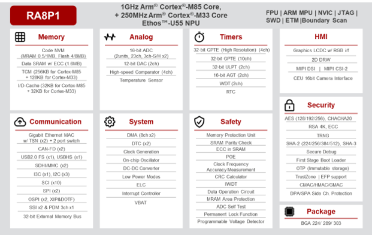
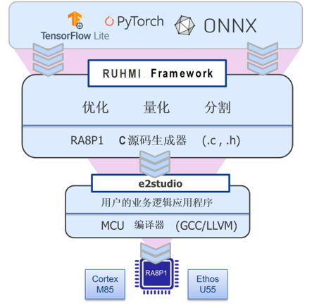

# Renesas RA8P1 AI 应用开发指南

RA8P1 系列是瑞萨电子首款搭载高性能 Arm® Cortex®-M85 (CM85) 及 Helium™ 矢量扩展，并集成 Ethos™-U55 NPU 的 32 位 AI 加速微控制器 (MCU)。 该系列通过单芯片实现 256 GOPS 的 AI 性能、超过 7300 CoreMarks 的突破性 CPU 性能和先进的人工智能 (AI) 功能，可支持语音、视觉和实时分析 AI 场景。 RA8P1 MCU 采用先进的 22nm ULL 工艺制造，有单核和双核两种配置方案，其中双核 MCU 集成 Cortex-M33 内核。



本指南面向使用 Renesas RA8P1 开发端侧 AI 应用的工程师，从平台概览和 MNIST 快速入门开始，依次覆盖 Keras/ONNX 模型转换与量化、平台配置、Ethos-U55 NPU 部署、验证优化和应用集成。

## 开发生态与工具资源

### Renesas RUHMI

Renesas 提供 [RUHMI](https://github.com/renesas/ruhmi-framework-mcu) 协助用户开发。它可用于将 AI 推理结果集成到图形界面和实际应用中。



### 模型资源

[RUHMI Model Zoo](https://github.com/renesas/ruhmi-model-zoo) 提供可用于模型评测的资源。

### Arm Ethos-U 工具链

Arm 在 [Ethos-U 项目页面](https://gitlab.arm.com/artificial-intelligence/ethos-u) 提供 NPU 相关文档和软件。常用资源包括：

## 从哪里开始

| 你的目标 | 建议路径 |
| --- | --- |
| 第一次使用 RA8P1 AI | 平台概述 -> MNIST 快速入门 -> 模型转换与量化 -> 平台配置 -> NPU 部署 |
| 已有浮点 Keras 模型 | 全整数量化 -> 平台配置 -> Vela 编译 -> 模型集成 |
| 已有 ONNX 模型 | onnx2tf -> FP32 TFLite 基线验证 -> 全整数量化 -> 平台配置 -> Vela 编译 |
| 已有全整数量化 TFLite | 平台配置 -> Vela 编译 -> 模型集成 -> 板端验证 |
| 模型运行失败 | 算子支持检查 -> 自定义算子 -> 常见问题 |

## 开发主线

```text
MNIST 快速入门
    |
    +-- 先走通 Vela、模型集成、烧录和推理验证
    |
    v
模型转换与量化
    |
    +-- Keras 直转或 ONNX 经 onnx2tf 转换、全整数量化、PC 精度验证
    |
    v
RA8P1 平台配置
    |
    +-- 时钟配置、内存规划、模型存储选择
    |
    v
TFLM + Ethos-U55 NPU 部署
    |
    +-- 模型集成、编译烧录、推理验证、性能分析
    |
    v
应用集成
    |
    +-- RUHMI 与实际应用集成
```

## 部署前确认

请从左侧导航的“1. RA8P1 AI 概述”开始按顺序阅读，或从 [RA8P1 产品页面](https://www.renesas.cn/zh/products/ra8p1) 获取平台资料。
